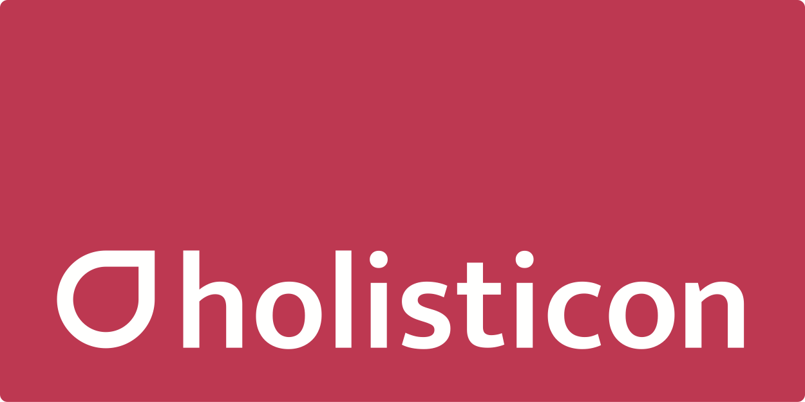
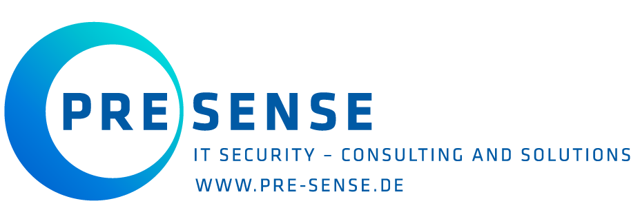
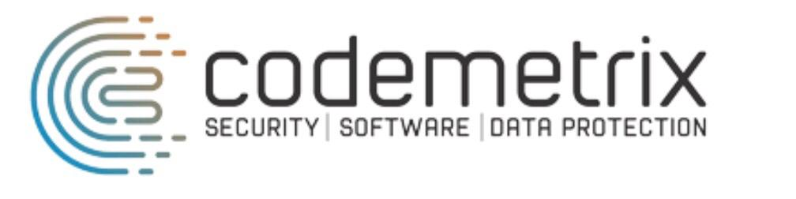

Elbsides is North Germany's annual computer security conference organized by the community for the community. [This year's](https://2019.elbsides.de) conference will take place on September, 16th 2019 at the [Side Hotel](https://www.side-hamburg.de) Hamburg.
      
Please see the [2019 conference web site](https://2019.elbsides.de) for further details and follow us at [@elbsides](https://twitter.com/elbsides) for updates!

## [Sponsors](https://2019.elbsides.de/sponsors.html) ##

Such an event cannot be organized without the support of the community as the admission fee is merely a token amount. So we cannot thank our sponsors enough in making this event possible.

<table>
		<tr>
			<td style="background-color: white; border: 5px solid #00d298;">
				
			</td>
			<td style="background-color: white; border: 5px solid #00d298;">
				
			</td>
			<td style="background-color: white; border: 5px solid #00d298;">
				
			</td>
		</tr>
		<tr>
			<td style="background-color: white; border: 5px solid #00d298;">
				
			</td>
			<td style="background-color: white; border: 5px solid #00d298;">
				
			</td>
			<td style="background-color: white; border: 5px solid #00d298;">
				
			</td>
		</tr>
		<tr>
			<td style="background-color: white; border: 5px solid #00d298;">
				
			</td>
			<td style="background-color: white; border: 5px solid #00d298;">
				
			</td>
			<td style="background-color: white; border: 5px solid #00d298;">
				
			</td>
		</tr>
		<tr>
			<td style="background-color: white; border: 5px solid #00d298;">
				
			</td>
			<td style="background-color: white; border: 5px solid #00d298;">
				
			</td>
			<td style="background-color: white; border: 5px solid #00d298;">
				
			</td>
		</tr>
</table>
	
	
	
We are currently sponsored by [DFN-CERT](https://www.dfn-cert.de),
[Schutzwerk GmbH ](https://www.schutzwerk.com),
[ Hamburg Port Authority ](https://www.hamburg-port-authority.de),
[Holisticon AG](https://www.holisticon.de),
[PRESENSE Technologies GmbH](https://www.pre-sense.de),
[Codemetrix GmbH](https://www.codemetrix.io),
[sum.cumo GmbH](https://www.sumcumo.com),
[Graylog](https://www.graylog.org), [Superluminar](https://superluminar.io), [Deloitte](http://www.deloitte.com/de), 
[BSidesMunich](https://www.bsidesmunich.org) and [Detlev Louis Motorrad-Vertriebsgesellschaft mbH](https://www.louis.eu), but we need more. See
the [2019 sponsor page](https://2019.elbsides.de/sponsors.html) for
more details.
	
As a community event, we strive to keep admission as low as possible but the fixed costs are high. We are dependent on sponsors to make this event happen.

